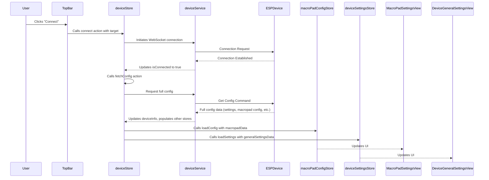
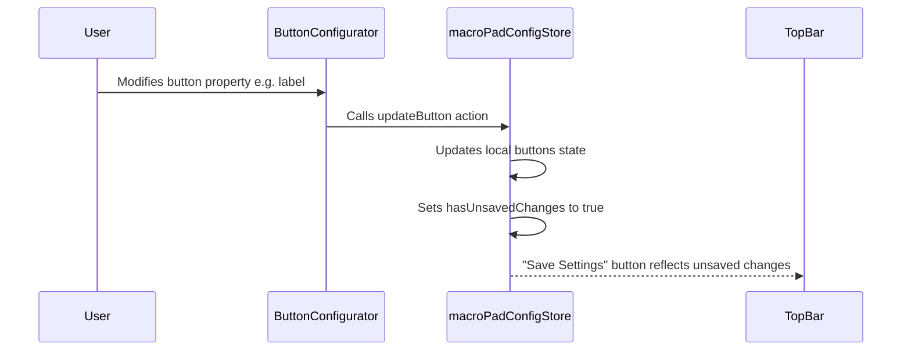
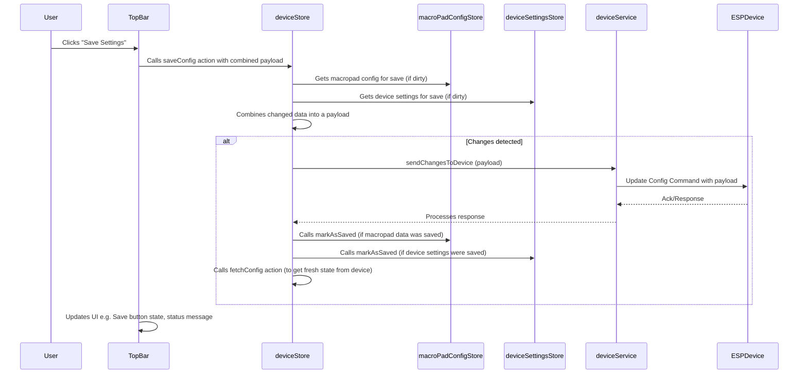
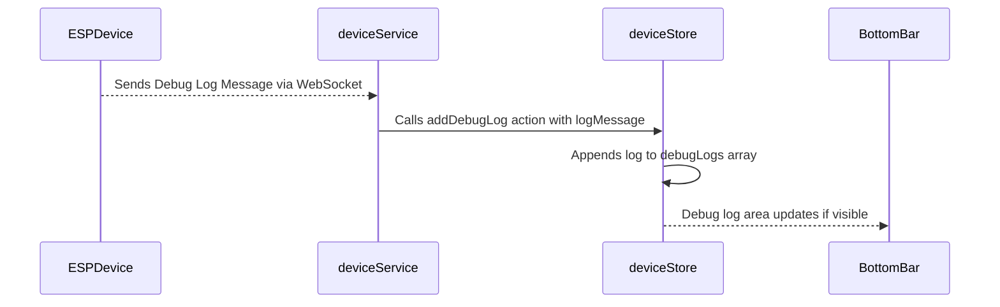

# Refactoring MacroPad.vue

This document outlines the plan to refactor the `MacroPad.vue` component into a more modular, maintainable, and extensible structure. The goal is to improve code organization, introduce a centralized state management approach for local changes, and create a layout that can accommodate future features like Dashboard and Now view settings.

## 1. Detailed Requirements

### 1.1. General
-   Split the existing `MacroPad.vue` functionality into multiple, smaller, and focused components.
-   Implement a clear three-part layout: Top View, Middle View (tabbed), and Bottom View.
-   Centralize local UI state and device interaction logic using Pinia stores.
-   Ensure the new structure is easily extensible for future views and settings.
-   Maintain existing functionality related to macropad button configuration, device connection, and settings management.

### 1.2. Top View
-   **Functionality**:
    -   Connect to device (displays device selection if multiple devices are found or a way to input device IP).
    -   Disconnect from device.
    -   Save current UI-driven settings (e.g., from MacroPad, Device Settings tabs) to the device.
    -   Reload settings from the device (discarding local unsaved changes).
    -   Reset device config to factory defaults.
    -   Reboot the device.
    -   Backup device config (download current config from device as JSON).
    -   Backup current config (download currently loaded config in UI, including unsaved changes, as JSON).
    -   Upload config (upload a JSON config file to be applied to the device).
    -   Indicate connection status (e.g., "Connected to ESP-Deck", "Disconnected", "Connecting...").
-   **UI**: A persistent bar at the top of the application.

### 1.3. Middle View (Tabbed Interface)
-   **Functionality**:
    -   A tab navigation system to switch between different views.
    -   Each tab will render a specific component.
-   **Tabs**:
    -   **MacroPad**:
        -   Displays the current macropad button configuration (similar to the existing `MacroPad.vue`).
        -   Allows users to modify button actions, labels, colors, etc.
        -   Handles local changes and prepares them to be saved to the device via the Top View's "Save Settings" button.
    -   **Dashboard**:
        -   Placeholder for future settings related to `@Dashboard.slint`.
        -   Initially can be an empty view with a message like "Dashboard settings coming soon."
    -   **Now**:
        -   Placeholder for future settings related to `@NowView.slint` (e.g., display preferences, data sources).
        -   Initially can be an empty view with a message like "Now settings coming soon."
    -   **Device Settings**:
        -   Manage general device settings:
            -   WiFi SSID
            -   WiFi Password
            -   Timezone Offset (e.g., UTC+5.5)
            -   API Key (if applicable for services)
-   **UI**: The main content area, changing based on the selected tab.

### 1.4. Bottom View
-   **Functionality**:
    -   Display current device status (e.g., firmware version, IP address, free memory - if available).
    -   Toggle for showing/hiding debug logs received from the device.
    -   A scrollable area to display debug logs when enabled.
-   **UI**: A persistent bar or section at the bottom of the application.

### 1.5. State Management
-   Use Pinia stores to manage:
    -   Device connection status and details.
    -   Current device settings (WiFi, TZ, API Key).
    -   Macropad button configurations (local copy, separate from device's actual state until saved).
    -   State of UI elements (e.g., selected tab, debug log visibility).
    -   Unsaved changes indication.

### 1.6. Non-Functional Requirements
-   **Maintainability**: Code should be well-organized, documented, and easy to understand.
-   **Extensibility**: Adding new views or settings should be straightforward.
-   **Responsiveness**: The layout should adapt to different screen sizes (mobile-first approach).
-   **Performance**: UI should remain responsive, especially when handling device communication and log display.

## 2. Mockup (Textual Description)

```
+--------------------------------------------------------------------------------------------------------+
| [TOP VIEW]                                                                                             |
|   [Connect/Disconnect Btn] [Save Settings Btn] [Reload Settings Btn] [Reset Settings Btn] [Reboot Btn] |
|   [Backup Device Config Btn] [Backup Current Config Btn] [Upload Config Btn] [Status: Connected]       |
+--------------------------------------------------------------------------------------------------------+
| [MIDDLE VIEW - TABS]                                                                                     |
|   [MacroPad Tab] [Dashboard Tab] [Now Tab] [Device Settings Tab]                                       |
+--------------------------------------------------------------------------------------------------------+
| [MIDDLE VIEW - CONTENT AREA]                                                                             |
|                                                                                                          |
|   IF MacroPad Tab Active:                                                                                |
|     +------------------------------------------------------------------+                                 |
|     | [Button Grid Configuration Interface]                            |                                 |
|     |   - Key 1: [Action Dropdown] [Label Input] [Color Picker]        |                                 |
|     |   - Key 2: [...]                                                 |                                 |
|     |   ...                                                            |                                 |
|     +------------------------------------------------------------------+                                 |
|                                                                                                          |
|   IF Dashboard Tab Active:                                                                               |
|     +------------------------------------------------------------------+                                 |
|     | "Dashboard settings coming soon."                                |                                 |
|     +------------------------------------------------------------------+                                 |
|                                                                                                          |
|   IF Now Tab Active:                                                                                     |
|     +------------------------------------------------------------------+                                 |
|     | "Now settings coming soon."                                      |                                 |
|     +------------------------------------------------------------------+                                 |
|                                                                                                          |
|   IF Device Settings Tab Active:                                                                         |
|     +------------------------------------------------------------------+                                 |
|     | WiFi SSID: [Input Field]                                         |                                 |
|     | WiFi Password: [Input Field]                                     |                                 |
|     | Timezone Offset: [Input Field/Select]                            |                                 |
|     | API Key: [Input Field]                                           |                                 |
|     +------------------------------------------------------------------+                                 |
|                                                                                                          |
+--------------------------------------------------------------------------------------------------------+
| [BOTTOM VIEW]                                                                                            |
|   [Device Status: Connected, IP: ..., FW: ...] [Show Debug Logs Toggle]                                  |
|   IF Debug Logs Visible:                                                                                 |
|     +------------------------------------------------------------------+                                 |
|     | [Log Line 1]                                                     |                                 |
|     | [Log Line 2]                                                     |                                 |
|     | ...                                                              |                                 |
|     +------------------------------------------------------------------+                                 |
+--------------------------------------------------------------------------------------------------------+
```

## 3. Architecture Details

### 3.1. Component Structure

```
src/
├── views/
│   └── MainView.vue (Replaces current App.vue or hosts the new layout)
├── layouts/
│   └── DefaultLayout.vue (Contains Top, Middle, Bottom views)
├── components/
│   ├── core/
│   │   ├── TopBar.vue
│   │   ├── BottomBar.vue
│   │   └── TabNavigation.vue
│   ├── macropad/
│   │   ├── MacroPadSettingsView.vue (Manages button grid)
│   │   ├── ButtonConfigurator.vue (Individual button config UI)
│   │   └── ... (other macropad related components)
│   ├── dashboard/
│   │   └── DashboardSettingsView.vue (Placeholder)
│   ├── now/
│   │   └── NowSettingsView.vue (Placeholder)
│   ├── device-settings/
│   │   └── DeviceGeneralSettingsView.vue
│   └── ui/ (Shadcn-Vue components if not already globally registered or extended)
│       ├── Button.vue
│       ├── Input.vue
│       ├── Tabs.vue
│       └── ...
├── stores/
│   ├── deviceStore.ts (Connection, status, basic device info, debug logs, device commands)
│   ├── macroPadConfigStore.ts (Local macropad button configurations, tracks changes)
│   ├── deviceSettingsStore.ts (WiFi, TZ, API key settings, tracks changes)
│   └── uiStore.ts (Active tab, debug log visibility, global UI states)
├── services/
│   └── deviceService.ts (Handles actual WebSocket/HTTP communication with the ESP device)
└── router/
    └── index.ts (Defines routes, e.g., main view)
```

### 3.2. State Management (Pinia)

-   **`deviceStore.ts`**:
    -   `State`: `isConnected`, `deviceInfo` (IP, FW version, etc.), `debugLogs` (array of strings), `isConnecting`, `isLoading` (generic loading state for device operations).
    -   `Actions`: `connect(targetDevice)`, `disconnect()`, `sendMessage(message)`, `fetchConfig()`, `saveConfig(configPayload)`, `resetConfig()`, `rebootDevice()`, `backupDeviceConfig()`, `backupCurrentUiConfig(currentConfig)`, `uploadConfig(fileContents)`, `addDebugLog(logMessage)`.
    -   `Getters`: `getFormattedStatus`, `hasDebugLogs`.
-   **`macroPadConfigStore.ts`**:
    -   `State`: `buttons` (array of button config objects), `hasUnsavedChanges`.
    -   `Actions`: `loadConfig(config)`, `updateButton(index, newConfig)`, `resetChanges()`, `markAsSaved()`.
    -   `Getters`: `getButtonConfig(index)`, `isDirty`, `getConfigForSave()`.
-   **`deviceSettingsStore.ts`**:
    -   `State`: `wifiSsid`, `wifiPassword`, `timezoneOffset`, `apiKey`, `hasUnsavedChanges`.
    -   `Actions`: `loadSettings(settings)`, `updateWifiSsid(ssid)`, `updateWifiPassword(password)`, ..., `resetChanges()`, `markAsSaved()`.
    -   `Getters`: `getCurrentSettings`, `isDirty`, `getSettingsForSave()`.
-   **`uiStore.ts`**:
    -   `State`: `activeTab` (e.g., 'macropad', 'dashboard'), `isDebugLogVisible`.
    -   `Actions`: `setActiveTab(tabName)`, `toggleDebugLogVisibility()`.
    -   `Getters`: `isActiveTab(tabName)`.

### 3.3. Routing
-   A single main route (e.g., `/`) could display the `MainView.vue` or `DefaultLayout.vue`.
-   Tab navigation will not use Vue Router routes but will instead control the visibility of components within the Middle View content area, managed by `uiStore.ts` and `TabNavigation.vue`.

### 3.4. Data Flow

#### 3.4.1. Connecting to Device & Fetching Initial Data


#### 3.4.2. Modifying a Macropad Button


#### 3.4.3. Saving UI-Driven Settings to Device (via "Save Settings" Button)


#### 3.4.4. Receiving Debug Logs


## 4. Phased Implementation Plan

### Phase 1: Boilerplate and Core Layout
1.  **Goal**: Set up the basic file structure, Pinia stores, and the main three-part layout (Top, Middle, Bottom) with placeholder components.
2.  **Tasks**:
    *   Create new directories: `webapp/src/layouts`, `webapp/src/components/core`, `webapp/src/components/macropad`, `webapp/src/components/dashboard`, `webapp/src/components/now`, `webapp/src/components/device-settings`.
    *   Create `webapp/src/views/MainView.vue` (or adapt `App.vue`) to use `DefaultLayout.vue`.
    *   Create `webapp/src/layouts/DefaultLayout.vue` with placeholders for `TopBar.vue`, `TabNavigation.vue`, content area, and `BottomBar.vue`.
    *   Create basic placeholder Vue components (template only, minimal script) for:
        *   `webapp/src/components/core/TopBar.vue`
        *   `webapp/src/components/core/BottomBar.vue`
        *   `webapp/src/components/core/TabNavigation.vue`
        *   `webapp/src/components/macropad/MacroPadSettingsView.vue`
        *   `webapp/src/components/dashboard/DashboardSettingsView.vue`
        *   `webapp/src/components/now/NowSettingsView.vue`
        *   `webapp/src/components/device-settings/DeviceGeneralSettingsView.vue`
    *   Set up Pinia store files with initial state definitions and empty actions/getters (as per Architecture section):
        *   `webapp/src/stores/deviceStore.ts`
        *   `webapp/src/stores/macroPadConfigStore.ts`
        *   `webapp/src/stores/deviceSettingsStore.ts`
        *   `webapp/src/stores/uiStore.ts`
    *   Ensure Vue Router is set up to display `MainView.vue`.
    *   Update `main.ts` to include Pinia.
3.  **Outcome**: A runnable Vue application displaying a static UI shell. The layout with Top, Middle (placeholder content), and Bottom sections is visible. Pinia stores are initialized. No interactivity yet, but the foundational structure is in place.

### Phase 2: Implement Top Bar and Device Core Functionality
1.  **Goal**: Implement device connection/disconnection, status display, and all direct device command buttons in `TopBar.vue` (Save Settings, Reload, Reset, Reboot, Backups, Upload).
2.  **Tasks**:
    *   Implement core actions in `deviceStore.ts`: `connect()`, `disconnect()`, `fetchConfig()`, `saveConfig()`, `resetConfig()`, `rebootDevice()`, `backupDeviceConfig()`, `backupCurrentUiConfig()`, `uploadConfig()`. These actions will interact with `deviceService.ts` (which might need creation/adaptation).
    *   Develop `TopBar.vue` UI with all specified buttons and connection status display.
    *   Connect `TopBar.vue` buttons and logic to the corresponding actions in `deviceStore.ts`.
    *   Dynamically display connection status and loading states from `deviceStore.ts` in `TopBar.vue`.
    *   The "Save Settings" button will call `deviceStore.saveConfig()`. This action will initially save a combined payload from `macroPadConfigStore.getConfigForSave()` and `deviceSettingsStore.getSettingsForSave()`. Since those stores are not fully implemented yet, they might return empty/default data, but the save mechanism itself will be functional.
    *   Other buttons (Reload, Reset, Reboot, etc.) will trigger their respective direct actions in `deviceStore.ts`.
3.  **Outcome**: User can reliably connect/disconnect. All buttons in `TopBar.vue` are functional: "Save Settings" attempts to save data (even if minimal initially), "Reload Settings" fetches config, "Reset Settings" and "Reboot Device" send commands, backup buttons trigger downloads, and "Upload Config" allows file selection and processing via `deviceStore`. Connection status and loading indicators are dynamically displayed.

### Phase 3: Implement Tab Navigation and UI Store
1.  **Goal**: Enable dynamic tab switching in the Middle View, controlling which settings component is displayed.
2.  **Tasks**:
    *   Implement `setActiveTab(tabName)` action and `activeTab` state in `uiStore.ts`.
    *   Modify `TabNavigation.vue` to display tabs and use `uiStore.ts` to set the active tab upon user interaction.
    *   Modify `DefaultLayout.vue` (or `MainView.vue`) to use a dynamic `<component :is="activeTabViewComponent">` in the middle content area, where `activeTabViewComponent` is computed based on `uiStore.ts.activeTab`.
    *   Map tab identifiers (e.g., 'macropad', 'dashboard', 'now', 'device-settings') to their respective view components (`MacroPadSettingsView.vue`, etc.).
3.  **Outcome**: Users can click tabs in `TabNavigation.vue` to switch between the different placeholder views (`MacroPadSettingsView.vue`, `DashboardSettingsView.vue`, `NowSettingsView.vue`, `DeviceGeneralSettingsView.vue`). The correct component is rendered in the middle content area based on the selected tab.

### Phase 4: Implement MacroPad Settings View
1.  **Goal**: Migrate and refactor the existing MacroPad button configuration functionality into `MacroPadSettingsView.vue`, integrating with `macroPadConfigStore.ts`.
2.  **Tasks**:
    *   Develop the UI for button configuration within `MacroPadSettingsView.vue` (and potentially `ButtonConfigurator.vue` for individual button settings, if needed for complexity).
    *   Implement actions in `macroPadConfigStore.ts`: `loadConfig(configFromDevice)`, `updateButton(index, newConfig)`, `resetChanges()`, `markAsSaved()`, and `getConfigForSave()`.
    *   Connect `MacroPadSettingsView.vue` to `macroPadConfigStore.ts` for displaying button configurations and dispatching updates.
    *   Ensure local changes correctly update `macroPadConfigStore.ts.hasUnsavedChanges`.
    *   The "Save Settings" button in `TopBar.vue` (implemented in Phase 2) will now pick up changes from `macroPadConfigStore.getConfigForSave()` and include them in the payload sent to the device via `deviceStore.saveConfig()`.
3.  **Outcome**: Full macropad button configuration functionality is available within the `MacroPadSettingsView.vue` tab. Users can modify button settings, these changes are tracked, and can be successfully saved to the device using the main "Save Settings" button.

### Phase 5: Implement Device General Settings View
1.  **Goal**: Implement the UI and logic for managing general device settings (WiFi, TZ, API Key) in `DeviceGeneralSettingsView.vue`.
2.  **Tasks**:
    *   Create the UI in `DeviceGeneralSettingsView.vue` for WiFi SSID, Password, TZ Offset, API Key inputs.
    *   Implement actions in `deviceSettingsStore.ts`: `loadSettings(settingsFromDevice)`, `updateWifiSsid(ssid)`, etc., `resetChanges()`, `markAsSaved()`, and `getSettingsForSave()`.
    *   Connect `DeviceGeneralSettingsView.vue` to `deviceSettingsStore.ts` for displaying and updating these settings.
    *   Ensure local changes correctly update `deviceSettingsStore.ts.hasUnsavedChanges`.
    *   The "Save Settings" button in `TopBar.vue` will now also pick up changes from `deviceSettingsStore.getSettingsForSave()`.
3.  **Outcome**: Users can view and modify general device settings (WiFi, TZ, API Key) within the `DeviceGeneralSettingsView.vue` tab. Changes are tracked and can be saved to the device using the main "Save Settings" button.

### Phase 6: Implement Bottom Bar (Device Status & Debug Logs)
1.  **Goal**: Implement device status display and debug log functionality in `BottomBar.vue`.
2.  **Tasks**:
    *   Display relevant device information (from `deviceStore.ts.deviceInfo` or specific getters) in `BottomBar.vue`.
    *   Implement `addDebugLog(logMessage)` action and `debugLogs` state in `deviceStore.ts`.
    *   Implement `isDebugLogVisible` state and `toggleDebugLogVisibility()` action in `uiStore.ts`.
    *   Add a toggle button/control in `BottomBar.vue` to call `uiStore.toggleDebugLogVisibility()`.
    *   Conditionally display the `deviceStore.ts.debugLogs` in a scrollable area within `BottomBar.vue` based on `uiStore.ts.isDebugLogVisible`.
    *   Ensure `deviceService.ts` (or the WebSocket handling part) calls `deviceStore.addDebugLog` when new log messages are received from the device.
3.  **Outcome**: The `BottomBar.vue` displays current device status. Users can toggle the visibility of a debug log panel, which shows timestamped messages received from the device.

### Phase 7: Implement Placeholder Content for Dashboard & Now Views
1.  **Goal**: Provide clear placeholder content for the `DashboardSettingsView.vue` and `NowSettingsView.vue`.
2.  **Tasks**:
    *   Ensure `DashboardSettingsView.vue` displays a user-friendly message like "Dashboard settings and customization options will be available here in a future update."
    *   Ensure `NowSettingsView.vue` displays a user-friendly message like "Settings for the 'Now' display will be available here in a future update."
3.  **Outcome**: All tabs are fully functional. The Dashboard and Now tabs present informative placeholders to the user, managing expectations for future development.

### Phase 8: Refinement, Styling, and Thorough Testing
1.  **Goal**: Polish the UI/UX, ensure consistent styling, add Shadcn-Vue components where appropriate, perform comprehensive testing, and clean up code.
2.  **Tasks**:
    *   Review all components and apply consistent styling using Tailwind CSS and integrate Shadcn-Vue components for UI elements like buttons, inputs, tabs, modals, etc., to achieve a modern look and feel.
    *   Ensure responsive design across common screen sizes (mobile, tablet, desktop).
    *   Thoroughly test all functionalities end-to-end: device connection/disconnection, all Top Bar button actions, tab navigation, MacroPad configuration saving/loading, Device Settings saving/loading, debug log display, error handling.
    *   Review and refactor code for clarity, conciseness, performance, and adherence to Vue/TypeScript best practices.
    *   Add any missing comments or documentation within the code.
    *   Test for graceful error handling (e.g., device disconnects, invalid API responses).
3.  **Outcome**: A stable, well-structured, visually appealing, and thoroughly tested refactored application that is ready for users. All functionalities from the original `MacroPad.vue` are preserved and enhanced within the new structure. 