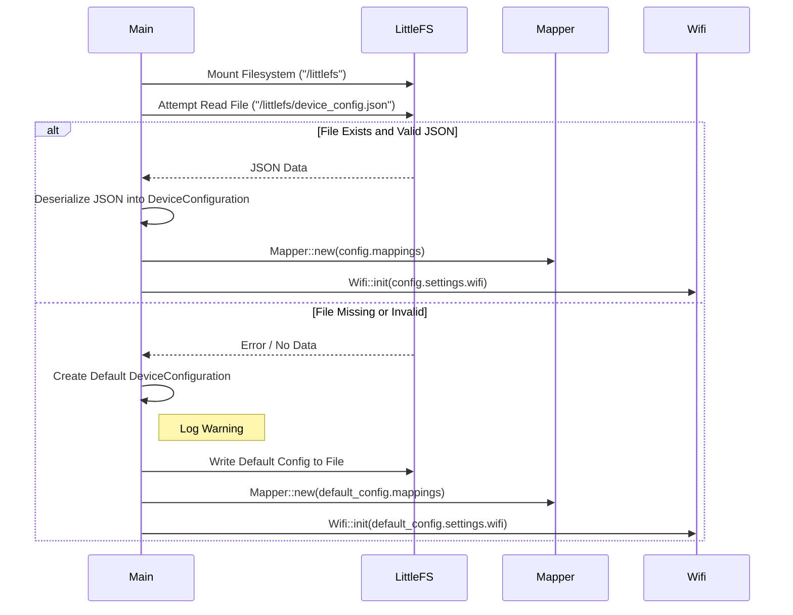

# Architecture: User-Friendly Configuration via LittleFS and WebUSB

This document describes the architecture for loading a unified device configuration (mappings, settings) from LittleFS and updating it via a WebUSB-enabled companion web application.

## Components

*   **ESP32 Firmware:** The Rust application running on the ESP-Deck device.
    *   **`main` Module:** Initializes hardware, LittleFS, USB stack (TinyUSB), loads the unified `DeviceConfiguration` from `/littlefs/device_config.json` (or creates defaults), distributes parts of the config (mappings to `Mapper`, Wi-Fi settings to `Wifi`), and spawns main application threads.
    *   **`Mapper` Module:** Initialized with `MappingConfiguration` data from the loaded `DeviceConfiguration`. Responsible for providing action sequences to the `Actor`.
    *   **`Wifi` Module:** Initialized with `WifiSettings` (SSID/password) from the loaded `DeviceConfiguration`. Manages Wi-Fi connection.
    *   **`Actor` Module:** Receives button press events from the UI, requests the corresponding action sequence from the `Mapper`, and executes the sequence by sending `HidAction` commands to the `UsbHidClient`.
    *   **`UsbHidClient` Module:** Sends HID reports (Keyboard, Mouse, Consumer) over USB based on commands received from the `Actor`.
    *   **`WebUSB Handler` (Component/Task):** Handles WebUSB communication.
        *   Listens for incoming data on the WebUSB endpoint.
        *   Implements length-prefix protocol to receive the *full* JSON for `DeviceConfiguration`.
        *   Uses `serde_json` to validate and deserialize the received data into `DeviceConfiguration`.
        *   If valid, writes the received JSON data to `/littlefs/device_config.json`.
        *   **Crucially:** Needs a mechanism to notify other modules (e.g., `Wifi`) that settings *may* have changed, potentially requiring re-initialization or reconnection.
        *   *Optional:* Sends success/failure status back to the host via WebUSB TX.
    *   **`LittleFS / VFS`:** Manages the `/littlefs/device_config.json` file on the flash partition.
    *   **`TinyUSB Stack`:** Provides USB HID and WebUSB interfaces.
    *   **`config` Module (New/Conceptual):** Defines the `DeviceConfiguration`, `DeviceSettings`, `WifiSettings` structs with `serde` derives.
*   **Companion Web Application:** A static web page (HTML, CSS, JavaScript) hosted on a PC.
    *   **UI:** Provides a user-friendly interface for editing *both* button mappings *and* device settings (like Wi-Fi).
    *   **Mapping & Settings Logic:** Translates UI state into a single JSON object conforming to the `DeviceConfiguration` structure.
    *   **WebUSB Communication:** Uses `navigator.usb` API to connect to the ESP32 device and transfer the length-prefixed `DeviceConfiguration` JSON data over the WebUSB OUT endpoint.
    *   *Optional:* Receives status updates from the device via the WebUSB IN endpoint.

## Data Flow Diagrams

### 1. Normal Operation (Button Press)

```mermaid
sequenceDiagram
    participant UI
    participant Actor
    participant Mapper
    participant UsbHidClient
    participant HostPC

    UI->>Actor: AppEvent::ButtonPressed(id)
    Actor->>Mapper: get_action_sequence(id)
    Mapper-->>Actor: Vec<HidAction>
    loop Action Sequence
        Actor->>UsbHidClient: AppEvent::UsbHidCommand(HID Report)
        Note right of Actor: Or execute Delay
        UsbHidClient->>HostPC: Send HID Report via USB
    end
```

### 2. Unified Configuration Loading at Startup



### 3. Configuration Update via WebUSB

```mermaid
graph TD
    subgraph Companion Web App (Browser)
        WebAppUI[Mapping & Settings UI] -->|Generates| JSONConfigString(DeviceConfiguration JSON)
        JSONConfigString -->|Length + Data| WebUSBJS(WebUSB JavaScript API)
    end

    subgraph ESP32 Firmware
        WebUSBHandler[WebUSB Handler Task/Callback] -->|Validates & Writes| LittleFS[(LittleFS Partition<br>/littlefs/device_config.json)]
        WebUSBHandler -->|Notifies (e.g. via channel)| Wifi(Wifi Module)
        LittleFS -->|Reads at next boot| Main(Main Module)
        Main -->|Distributes| Mapper
        Main -->|Distributes| Wifi
        TinyUSB(TinyUSB Stack<br>WebUSB Endpoint) --> WebUSBHandler
    end

    WebUSBJS -->|device.transferOut()| USB(USB Cable) --> TinyUSB
```

## Key Architectural Decisions

*   **Unified Configuration:** Storing all user-configurable parameters (mappings, settings) in a single structure (`DeviceConfiguration`) and file (`device_config.json`) simplifies loading and updating.
*   **Decoupling:** `Mapper` handles mappings, `Wifi` handles Wi-Fi, `WebUSB Handler` manages updates. Configuration is loaded centrally in `main` and distributed.
*   **Configuration Format:** JSON remains suitable.
*   **Storage:** LittleFS on internal flash remains suitable.
*   **Communication Protocol:** WebUSB + Length-prefixing remains suitable.
*   **Fallback:** Default configuration generation ensures basic functionality and creates an initial config file.
*   **Applying Settings:** A mechanism (TBD: channels, shared state, signals) is needed for the `WebUSB Handler` to inform relevant modules (like `Wifi`) about potential configuration changes that require action *without* a full device reboot. 