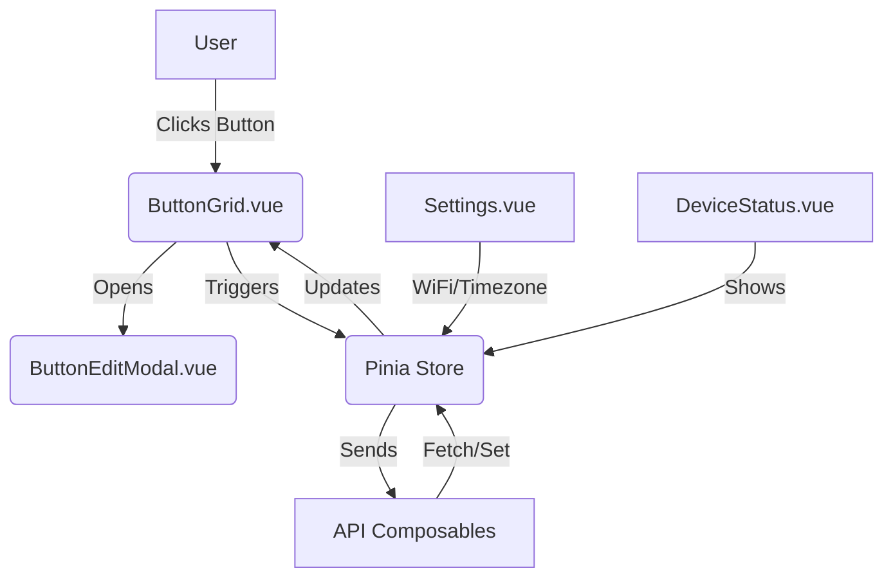

# Project: ESP Deck Webapp

## Mockup / Problem Description

This project is a modern webapp for controlling and configuring an advanced macro pad device (like an Elgato Stream Deck) with up to 16 customizable buttons. The device supports:
- Custom button actions (keyboard, mouse, media, macros)
- Editable button names (with emoji/icons)
- WiFi configuration
- Timezone selection
- Device management (fetch/set/reset config, reboot)

### Key Features
- **Dashboard:** Visual grid of 16 buttons, device status (WiFi, time, connection), test/trigger buttons
- **Button Configuration:** Edit names, assign actions, drag-and-drop or modal editing
- **Device Settings:** WiFi, timezone, device info
- **Device Management:** Fetch/save/reset config, reboot
- **Modern UX:** Responsive, dark/light theme, feedback (modals, toasts, loaders)

#### Wireframe
```
+------------------------------------------------------+
| [Header: Device Name]   [WiFi Status] [Time] [Menu]  |
+------------------------------------------------------+
| [Sidebar: Settings/Buttons/Info]                     |
| +----------------------------------------------+     |
| | [Button Grid: 4x4, each shows name/icon]     |     |
| +----------------------------------------------+     |
| | [Button: Edit] [Button: Save] [Button: Reset]|     |
| +----------------------------------------------+     |
+------------------------------------------------------+
| [Footer: Status, version, copyright]                |
+------------------------------------------------------+
```

---

## Requirements

- Visualize and edit a 4x4 grid of buttons, each with:
  - Name (with emoji/icon)
  - Configurable action (keyboard, mouse, media, macro)
- Edit button configuration via modal/dialog
- Show device status: WiFi, time, connection
- Configure WiFi (SSID, password)
- Set timezone
- Fetch, save, reset device configuration
- Reboot device
- Responsive design (mobile/desktop)
- Modern UI (Tailwind, Shadcn-Vue)
- Use Pinia for state management
- Use composables for API/device communication
- Provide user feedback (modals, toasts, skeleton loaders)

---

## Architecture

### High-Level Overview
- **Frontend:** Vite + Vue 3 + TypeScript + Tailwind CSS + Shadcn-Vue
- **State Management:** Pinia
- **API Communication:** Composables for device protocol (USB/Web/other)
- **Component Structure:**
  - App.vue (layout)
  - Dashboard (ButtonGrid.vue)
  - ButtonEditModal.vue
  - Settings.vue
  - DeviceStatus.vue
  - Sidebar.vue

### Data Flow
- Pinia store holds device config/state
- API composables handle communication (fetch/set/reset/reboot)
- Components consume store and composables

### Example Mermaid Diagram


---

## Plan

### Phase 1: Boilerplate & Structure
- [x] Vite + Vue 3 + TypeScript + Tailwind + Shadcn-Vue setup
- [x] Scaffold main directories: components, composables, stores, views, types
- [x] Set up Pinia store
- [x] Set up routing (if needed)

### Phase 2: Core UI & State
- [x] Implement App.vue layout
- [x] Implement Dashboard (ButtonGrid.vue)
- [x] Implement DeviceStatus.vue
- [x] Implement Settings.vue

### Phase 3: Device Communication
- [x] Create composables for device protocol (fetch/set/reset/reboot)
- [x] Integrate Pinia store with API composables
- [ ] Implement feedback (toasts, loaders)

### Phase 4: Button Configuration
- [ ] Implement ButtonEditModal.vue
- [ ] Support editing names, actions, macros
- [ ] Drag-and-drop or modal editing

### Phase 5: Polish & Advanced Features
- [ ] Responsive/mobile design
- [ ] Dark/light theme toggle
- [ ] Advanced feedback (skeleton loaders, error handling)
- [ ] SEO and PWA enhancements (if needed)

---

## References

- `webusbtest.html`: Test client for WebUSB protocol and device communication
- `src/protocol.rs`: Device protocol definitions (commands, responses)
- `src/config.rs`: Device configuration structures and logic
- `src/mapper.rs`: Button mapping and macro logic
- `src/main.rs`: Device main entry point and orchestration
- `src/ui.rs`: Device UI logic
- `ui/main.slint`: Device UI layout and design

This document should be updated as the project evolves. 